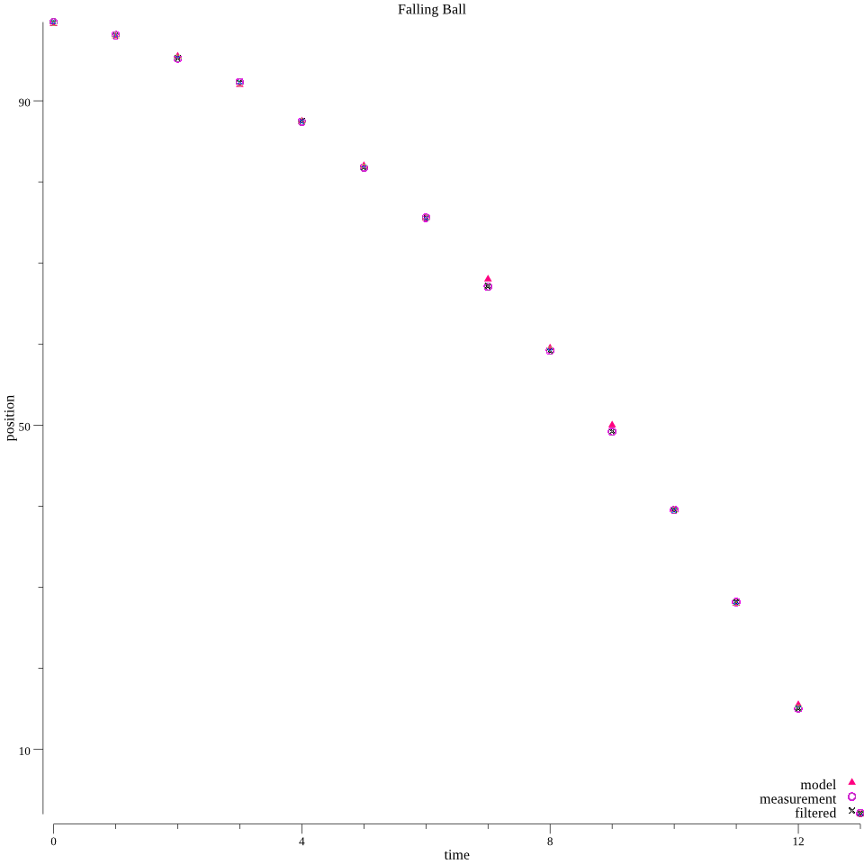

# Unscented Kalman Filter

This package implements [Unscented Kalman Filter](https://en.wikipedia.org/wiki/Kalman_filter#Unscented_Kalman_filter) also known as Sigma-point filter.

# Example output

